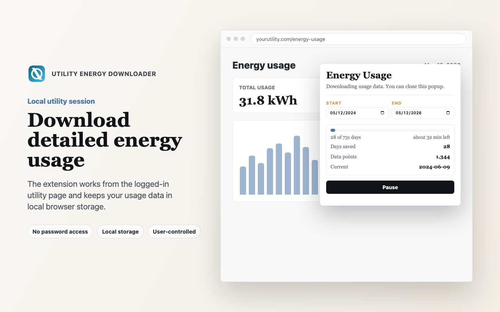
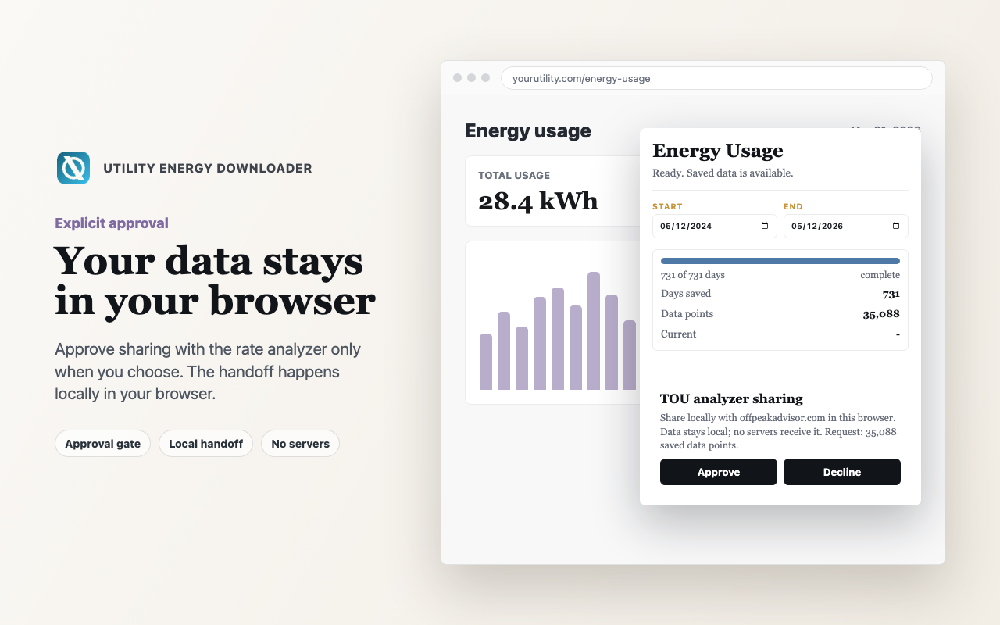

# Utility Energy Downloader Chrome Extension

> [!IMPORTANT]
> This extension is independent and is not affiliated with, endorsed by, approved by, or sponsored by any electric utility.

> [!WARNING]
> Use this extension at your own risk. Verify all exported data before relying on it. The extension authors and contributors take no responsibility for errors, omissions, account issues, data loss, billing decisions, or any other consequences from using this extension or its output.

Local-only Chrome extension for downloading meter usage time-series data from the user's own logged-in electric utility browser session.

Use this extension only with your own authorized utility account.

## Preview



The popup controls a local download from the utility energy usage page and stores captured usage data in the user's browser profile.



Sharing with the rate analyzer requires explicit approval, and the data handoff stays local in the user's browser.

## Privacy model

- The extension runs only on the supported utility's post-login energy usage page.
- It is not injected into the sign-in provider page. It can only run after the user has logged in normally and opened the supported energy usage page.
- It does not ask for, read, or transmit utility account credentials.
- Usage interval rows are stored in Chrome's local extension storage.
- Exports and approved Time-of-Use Rate Analyzer imports are generated locally as sanitized CSV.
- The Time-of-Use Rate Analyzer at [offpeakadvisor.com](https://offpeakadvisor.com) can receive the sanitized CSV only after the user approves the pending request in the extension popup.
- After approval, the analyzer keeps the imported CSV data in local browser storage for that site. The analyzer does not send the CSV, interval data, credentials, or telemetry to a backend service.
- There is no backend service and no analytics.

## Development install

1. Open `chrome://extensions`.
2. Enable Developer mode.
3. Click **Load unpacked**.
4. Select this repository directory.
5. Open the supported utility's energy usage page and log in normally.
6. Open the extension popup and start a download.

## Local store artwork

Generate local Chrome Web Store screenshots and promo tiles with:

```sh
npm run build:local
```

The generator writes committed README/source assets to `docs/screenshots/` and `docs/promo/`, and upload-ready Chrome Web Store copies to ignored `release/chrome-web-store/` paths. The Playwright scripts use managed Chromium by default; run `npx playwright install chromium` if the browser has not been installed yet, or set `CHROME_BIN` to use a specific Chrome/Chromium executable.

## How it works

The extension injects `src/page-hook.js` into the energy usage page at document start. That hook wraps `fetch`, `XMLHttpRequest`, and JSON parsing, watches for usage time-series payloads, and sends only minimal interval fields (`readDate`, `readTime`, and `usage`) to the isolated content script.

`src/content.js` owns the resumable download state machine. It switches the page to the One Day view, sets the usage date field one day at a time, waits for the page to make its own authenticated request, normalizes the interval rows, and stores each successful day independently. If a day fails repeatedly, the job pauses and can be resumed later.

`src/popup.js` provides start, pause, resume, CSV export, approved analyzer sharing, and clear controls.

## License

This extension is distributed under the Pando Research Source Available License v1. See `LICENSE.md`.

## End user license

The Store listing and packaged extension should include `EULA.md` as the extension's end user license agreement. Source code access and redistribution are governed by `LICENSE.md`.

## Current limitations

- Chrome/Chromium only.
- The extension depends on the supported utility's current energy usage page and endpoint names.
- The downloader assumes interval data is exposed through the utility's One Day usage view.
- If the utility site is unavailable, the user session expires, or a day fails repeatedly, the job pauses and can be resumed later.
- The TOU analyzer import still requires explicit approval in the extension popup.
